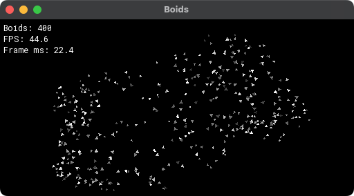

# Boids

A real-time **C++20 flocking simulation** using **structure-of-arrays state, uniform-grid spatial queries, fixed-step simulation, and batched SFML rendering**.



The project implements the classic separation, alignment, and cohesion rules for 400 autonomous agents in a bounded 2D world. The main focus is efficient neighborhood queries and a compact data-oriented simulation loop rather than visual complexity.

## Technical highlights

-   **Structure-of-arrays (SoA)** storage for positions, velocities, and force buffers
-   **Uniform spatial grid** for neighborhood queries instead of global all-pairs searching
-   Radius-aware cell traversal based on the largest interaction distance
-   Fixed-step simulation at approximately **60 Hz**, independent of render cadence
-   Separation, alignment, and cohesion with distance-based weighting
-   Batched triangle rendering through a single SFML vertex array
-   Deterministic regression tests using CTest
-   AddressSanitizer and UndefinedBehaviorSanitizer verification

## Flocking rules

Each boid responds to nearby agents using three steering behaviors:

-   **Separation** pushes away from neighbors within 10 units, with influence decreasing with distance.
-   **Alignment** steers toward nearby velocities within 55 units.
-   **Cohesion** steers toward the average position of neighbors within 105 units.

These are artistic flocking weights rather than a physical model.

Boids bounce at the edges of the simulation domain and briefly change color when they collide with a boundary.

## Spatial grid

A naive flocking implementation can compare every boid with every other boid each update. This project instead partitions the world into uniform grid cells.

At the beginning of each simulation step:

1. The grid is cleared.
2. Each boid is inserted into the cell containing its current position.
3. Neighbor queries inspect only cells that could contain boids inside the maximum interaction radius.
4. Candidates are filtered by exact distance before the flocking rules are evaluated.

The number of searched cells is derived from:

```text
ceil(max_interaction_radius / cell_size)
```

With a 64-unit cell size and a 105-unit maximum flocking radius, queries search through offsets of up to ±2 cells.

There is no artificial neighbor cap; every qualifying neighbor contributes.

The grid improves typical neighbor-search behavior when cell occupancy remains moderate, but it does not guarantee linear complexity. Dense clustering can still produce **O(N²)** work in the worst case.

## Data layout

Boid state is stored in separate contiguous arrays:

```text
position_x[]
position_y[]

velocity_x[]
velocity_y[]

force_x[]
force_y[]
```

A boid's index identifies its data across all arrays.

This structure-of-arrays layout keeps simulation fields contiguous and avoids storing each boid as a larger object containing all of its state.

Grid cells store boid indices rather than copies of boid data.

## Simulation update

Each fixed simulation step performs:

1. Rebuild the spatial grid
2. Compute flocking forces for every boid from the same state snapshot
3. Apply acceleration and update velocity
4. Integrate positions
5. Resolve world boundaries
6. Build velocity-oriented triangle geometry
7. Render the vertex array and timing overlay

All boid forces are calculated before any velocity updates are applied, preventing earlier-updated boids from affecting later neighbor calculations within the same step.

## Fixed-step timing

Simulation updates run at approximately 60 Hz using a fixed timestep.

Rendering runs independently, with elapsed frame time accumulated until another simulation step is required.

This avoids making flocking behavior depend directly on rendering speed.

Force scaling preserves the original tuning around the 60 Hz reference rate. Very long frame stalls are capped during catch-up so the application does not attempt an excessive number of simulation updates at once.

## Validation

The project includes a small deterministic regression suite built with CTest.

| Test               | Coverage                                                          |
| ------------------ | ----------------------------------------------------------------- |
| `grid_reference`   | Grid neighbor results compared against brute-force search         |
| `radius_coverage`  | Multi-cell interaction-radius and edge cases                      |
| `dense_neighbours` | Dense cells, duplicate prevention, and uncapped neighbor handling |
| `vector_safety`    | Zero-length and coincident-vector numerical safety                |
| `finite_state`     | Long-running finite-state and bounds checks                       |
| `boundaries`       | Large-step boundary handling                                      |
| `time_scaling`     | Fixed-step and time-scaled simulation behavior                    |

The cleanup was verified with Debug and Release builds using Apple Clang 15 and SFML 3.0.2 on Apple Silicon.

All seven tests passed in both configurations without compiler warnings. The suite also passed with AddressSanitizer and UndefinedBehaviorSanitizer enabled.

These tests check implementation correctness and regression behavior; they are not performance benchmarks or physical-validation tests.

## Build and run

Requirements:

-   C++20 compiler
-   CMake 3.16+
-   SFML 3 with Graphics, Window, and System components

On macOS with Homebrew:

```bash
brew install cmake sfml
```

Clone and build:

```bash
git clone https://github.com/SteveCutler/boids_sfml.git
cd boids_sfml

cmake -S . -B build -DCMAKE_BUILD_TYPE=Release
cmake --build build --parallel

ctest --test-dir build --output-on-failure

./build/Boids
```

Use `-DBUILD_TESTING=OFF` if the test target is not needed.

Linux and Windows builds were not verified during the portfolio cleanup.

## Controls

The application is intentionally minimal:

| Input        | Action          |
| ------------ | --------------- |
| Window close | Exit simulation |

Simulation size, boid count, and grid cell size are configured in `src/main.cpp`. Flocking radii and weights are defined in `src/BoidSystem.hpp`.

## Complexity and limitations

-   Grid construction costs **O(C + N)** for `C` grid cells and `N` boids.
-   Neighbor-query cost depends on occupancy in nearby cells.
-   Dense clustering can still approach **O(N²)** work.
-   Boundary handling clamps boid centers and reverses outward velocity; overshoot is discarded.
-   Velocity is limited per component rather than by total magnitude.
-   Near-zero vectors produce zero steering rather than artificial separation.
-   Fixed-step integration is approximate and rendered states are not interpolated.
-   The SoA layout and spatial grid do not imply SIMD, multithreading, GPU execution, or allocation-free updates.
-   The on-screen FPS/frame-time display is informational and should not be treated as a benchmark.

## Project structure

```text
CMakeLists.txt

src/
  main.cpp
  BoidSystem.hpp

tests/
  boids_tests.cpp

assets/fonts/
  Roboto Mono font and OFL license

docs/
  media/
  third-party/

THIRD_PARTY.md
```

## Acknowledgements

-   [SFML](https://www.sfml-dev.org/) provides rendering, window/input handling, timing, and vector types. The original drawing scaffold was adapted from SFML's [vertex-array / particle-system tutorial](https://www.sfml-dev.org/tutorials/3.0/graphics/vertex-array/). The flocking rules, SoA state, and spatial-grid implementation are project additions.
-   [Roboto Mono](assets/fonts/README.md) is bundled under the [SIL Open Font License 1.1](assets/fonts/OFL-RobotoMono.txt).

See [`THIRD_PARTY.md`](THIRD_PARTY.md) for provenance and notices.

No project-level license has been selected for the original source code.
